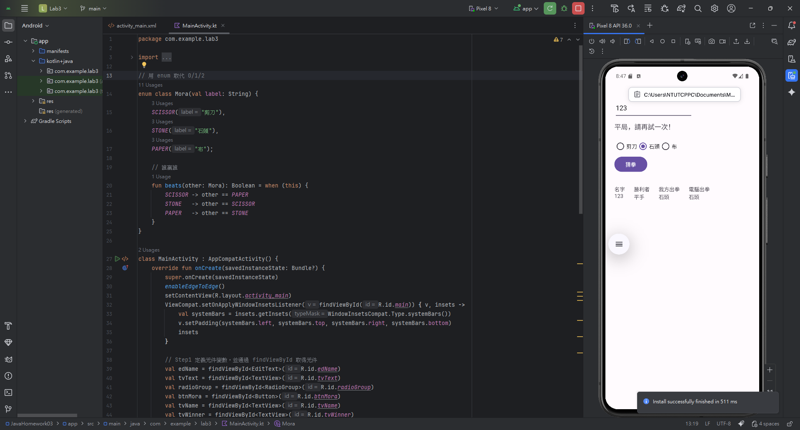
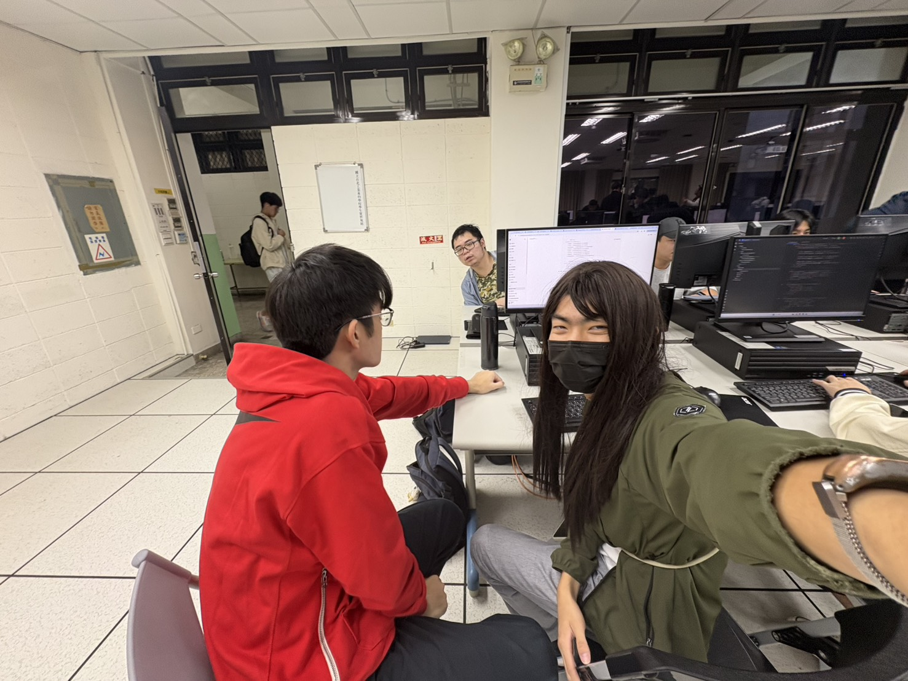
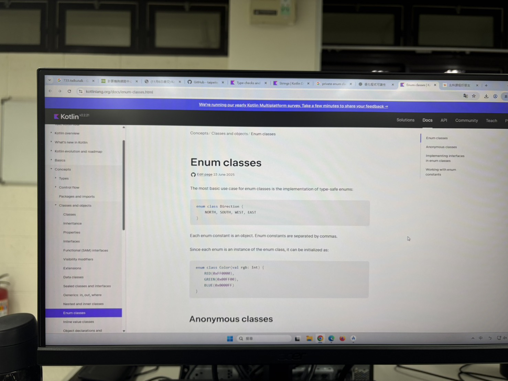

# Java 程式碼練習

## 心得

這次的作業老師要我們最佳化程式碼的可讀性，不要讓邏輯以 0、1、2 的方式出現。

在和同組的同學討論的過程中，我們第一個想到的是 C/C++ 中的 #define 指示器，能夠在不變更程式碼邏輯的情況下，使用比較有意義的單字來替代。

於是我們利用 ChatGPT，詢問他在這個方向上有沒有什麼在 Kotlin 中可以用的方法，他提示我們可以使用 enum class，並提供給我一些範例。

但為了自己搞懂這個功能在做什麼，我還是請他給我官方的文件，並且和我的同學在讀書會中自己閱讀討論了一下，後續再來嘗試改進程式碼的部分。

```kotlin
// 用 enum 取代 0/1/2
enum class Mora(val label: String) {
    SCISSOR("剪刀"),
    STONE("石頭"),
    PAPER("布");

    // 誰贏誰
    fun beats(other: Mora): Boolean = when (this) {
        SCISSOR -> other == PAPER
        STONE   -> other == SCISSOR
        PAPER   -> other == STONE
    }
}
```

```kotlin
            // Step9 判斷勝負
            when {
                myMora == targetMora -> {
                    tvWinner.text = "勝利者\n平手"
                    tvText.text = "平局，請再試一次！"
                }
                myMora.beats(targetMora) -> {
                    tvWinner.text = "勝利者\n$playerName"
                    tvText.text = "恭喜你獲勝了！！！"
                }
                else -> {
                    tvWinner.text = "勝利者\n電腦"
                    tvText.text = "可惜，電腦獲勝了！"
                }
            }
```

Kotlin 和 Java 在撰寫上有很多的不同，以我初學者的淺顯視角來看大概是 Kotlin 比較親切一點。兩者看起來都是物件導向的語言，我覺得 Lotlin 寫起來比較像 Python 一點；Java 寫起來則比較像是更往物件導向靠攏的 C++。

例如在變數的定義和元件的綁定上，寫法就有很多不一樣：

```java
    private EditText ed_name;
    private TextView tv_text, tv_name, tv_winner, tv_mmora, tv_cmora;
    private RadioButton btn_scissor, btn_stone, btn_paper;
    private Button btn_mora;

    ...

        ed_name = findViewById(R.id.ed_name);
        tv_text = findViewById(R.id.tv_text);
        tv_name = findViewById(R.id.tv_name);
        tv_winner = findViewById(R.id.tv_winner);
        tv_mmora = findViewById(R.id.tv_mmora);
        tv_cmora = findViewById(R.id.tv_cmora);
        btn_scissor = findViewById(R.id.btn_scissor);
        btn_stone = findViewById(R.id.btn_stone);
        btn_paper = findViewById(R.id.btn_paper);
        btn_mora = findViewById(R.id.btn_mora);
```

```kotlin
        val edName = findViewById<EditText>(R.id.edName)
        val tvText = findViewById<TextView>(R.id.tvText)
        val radioGroup = findViewById<RadioGroup>(R.id.radioGroup)
        val btnMora = findViewById<Button>(R.id.btnMora)
        val tvName = findViewById<TextView>(R.id.tvName)
        val tvWinner = findViewById<TextView>(R.id.tvWinner)
        val tvMyMora = findViewById<TextView>(R.id.tvMyMora)
        val tvTargetMora = findViewById<TextView>(R.id.tvTargetMora)
```

## Github

### 網址：
[https://github.com/Dao-you/JavaHomework03](https://github.com/Dao-you/JavaHomework03)

### 截圖：


## 程式碼執行



# 讀書會

* 組員：方宇澤
* 討論時間：2025/10/31 15:00~16:00
* 地點：電腦教室(做完實驗之後討論)
* 討論主題：程式碼可讀性最佳化、Kotlin 基本、enum class 的使用


